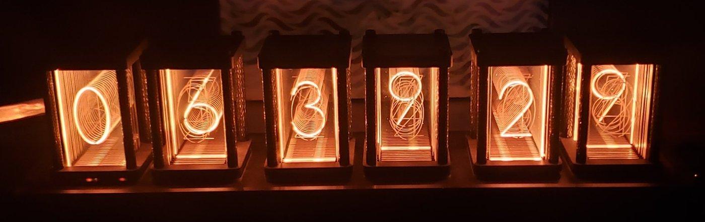
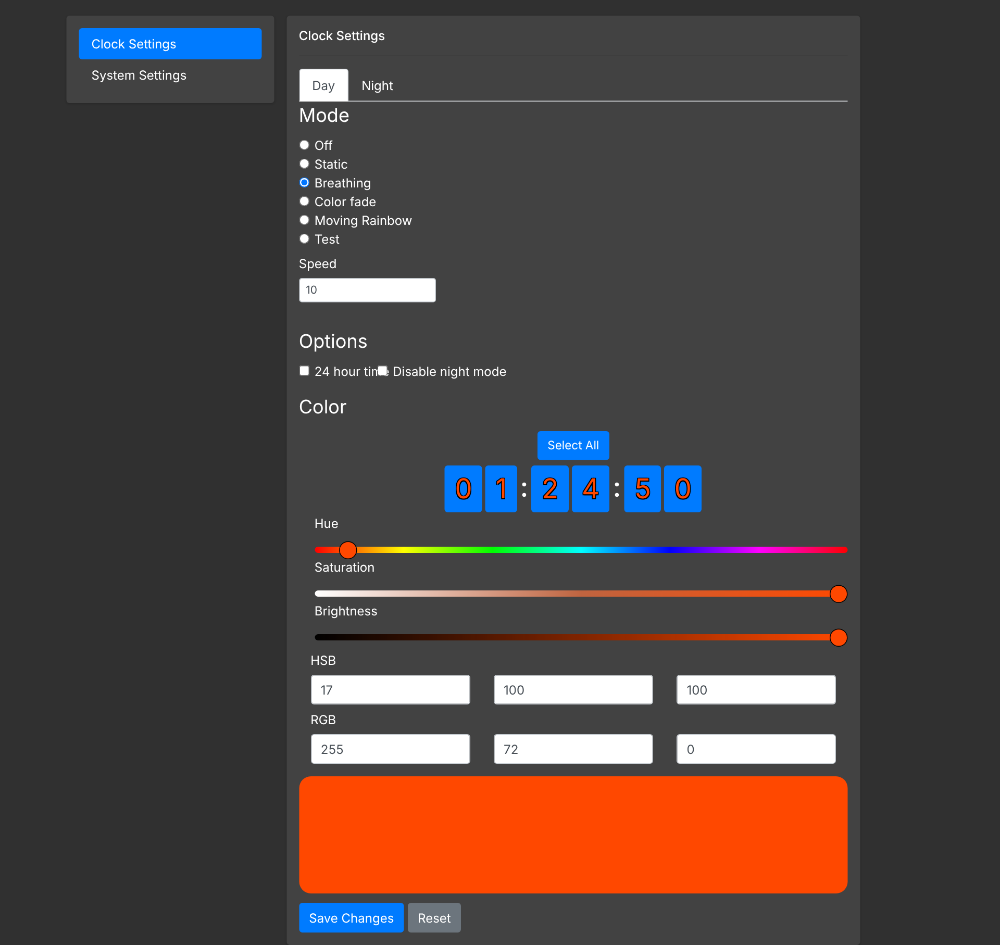
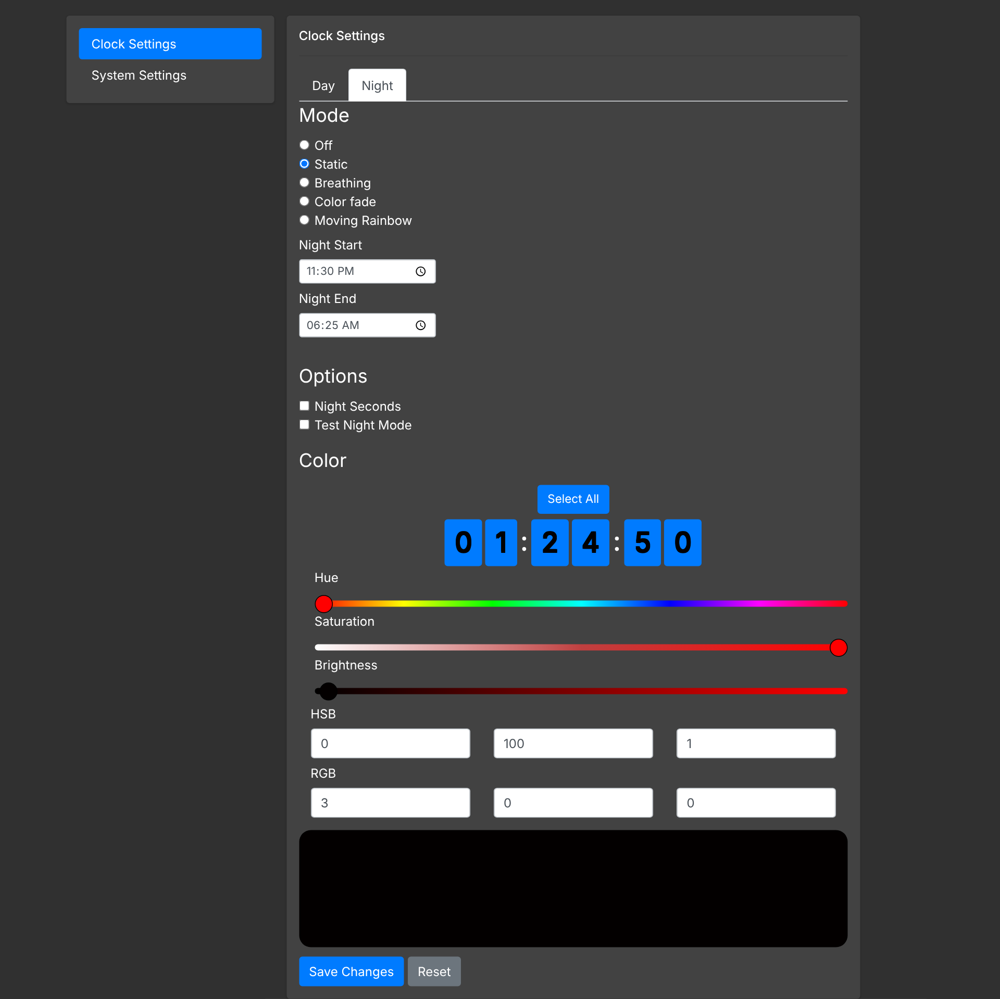

# NixiClock

A six-digit, nixie-style LED clock run by a **Raspberry Pi Zero**, with a phone-friendly web page for changing its colors and lighting modes. Each digit has its own 20 addressable LEDs, one pair per numeral 0-9, so every digit can have its own color and the clock can run animated effects.

The clock started out as an off-the-shelf nixie-style LED clock from Amazon. Its original electronics and software were poor, so I replaced them:
- I mapped out how the existing LEDs were wired: which pair lights which numeral in each digit.
- I swapped the original controller for a Raspberry Pi Zero, which gives the clock Wi-Fi and a web settings page.
- I wrote the software in this repo to drive the existing LEDs.



*Showing 06:39:29 in warm orange, a nixie-tube look made with LEDs.*

## Web control page

Served straight from the clock on port 80, so you open `http://<pi-address>/` from any device on the network.

| Day settings | Night settings |
|---|---|
|  |  |

- **Modes:** Off, Static, Breathing, Color fade, Moving rainbow (plus a Test mode that cycles all digits)
- **Per-digit color:** tap a digit (or *Select All*) and set its color with hue/saturation/brightness sliders, or type HSB or RGB values directly
- **Speed** for the animated modes
- **12/24-hour** display
- **Night mode:** a separate mode and color set (e.g. very dim red) between a *Night Start* and *Night End* time. It can optionally hide seconds at night, and has a "Test Night Mode" toggle to preview it in the daytime.

## How it fits together

```
 Browser ──HTTP──▶ WebServer/server.js (Node + Express, port 80)
                        │ writes
                        ▼
              /home/pi/clock/settings.json
                        ▲ polls for changes
                        │
                 Python/main.py ──▶ NeoPixel strip (120 LEDs, GPIO 12)
```

- `WebServer/server.js` serves the page and saves whatever the page posts to `settings.json`.
- `Python/main.py` loops forever. It re-reads `settings.json` whenever the file changes, works out day/night, and draws the current time to the LEDs.

## Hardware

- The case, digit panels and LED boards from the original clock. Only the controller was replaced.
- Raspberry Pi Zero with Wi-Fi (Zero W or Zero 2 W)
- The clock's existing 120 addressable LEDs (6 digits × 20), driven as one WS2812/NeoPixel-type chain: data on **GPIO 12** (`board.D12`), GRB order
- A suitable 5 V supply for the LEDs

## Install

The code expects to live in `/home/pi/clock/`:

```bash
git clone https://github.com/notchrisyoung/NixiClock.git /home/pi/clock
cd /home/pi/clock

# LED driver
sudo pip3 install adafruit-circuitpython-neopixel

# Web server
cd WebServer && npm install express
```

Run both (as root, since the NeoPixel driver and port 80 both need it):

```bash
sudo python3 /home/pi/clock/Python/main.py &
sudo node /home/pi/clock/WebServer/server.js &
```

To start them at boot, add both commands to `/etc/rc.local` or create systemd services.

## Files

| Path | Purpose |
|---|---|
| `Python/main.py` | LED driver: time display, modes, day/night switching |
| `WebServer/server.js` | Express server for the page and the settings API |
| `WebServer/client/index.html`, `main.js` | The settings page |
| `WebServer/client/bootstrap*`, `jquery.min.js` | Vendored front-end libraries |
| `settings.json` | Current clock settings (written by the web page) |
